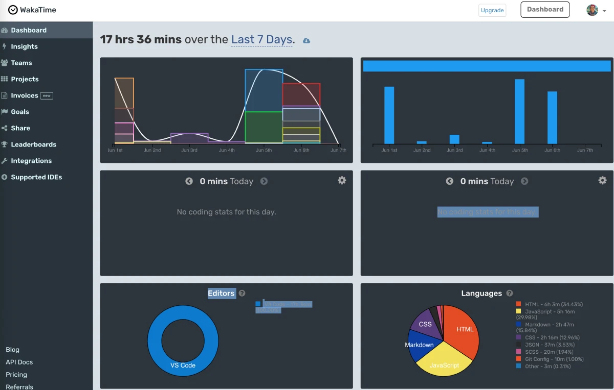
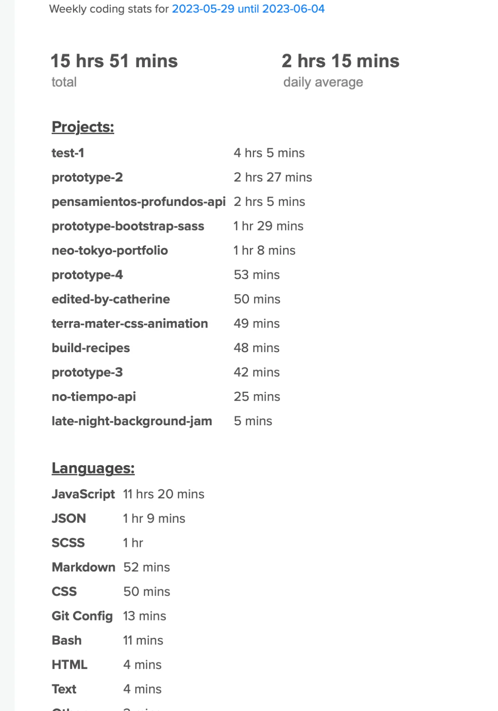

# How to get Wakatime to your GitHub

## What is WakaTime?
WakaTime is a personal analytics service for programmers that shows you how you spend your time and helps you be more productive.

<br>

## How to Install
1. Signup at [wakatime.com](wakatime)

2. Fill out profile info [wakatime.com/settings/profile](https://wakatime.com/settings/profile)
- Display photo publicly ✅
- Total code time badge ✅
- Display code time publicly ✅ -> Set to "All Time"
- Display langauges, editors, categories, publicily ✅

3. Verify your email address with Wakatime.

4. Link Wakatime to your VSC [wakatime.com/vs-code](https://wakatime.com/vs-code)

5. In your readme add the following code.
`INSERT-YOUR-GH-USERNAME` => Enter your Github
```
  
  ```
  
6. Wait about an hour for the widget to show on your readme. Give it 24 hour to populate with data.

<br>

## Sample of WakaTime

### Widget on Readme
  

<br>

### Wakatime Dashboard (at wakatime.com)


<br>

### Wakatime Email
