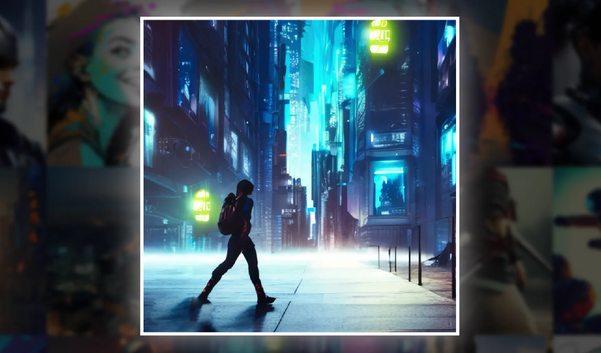

## Backdrop-Filter
[](https://jsohndata.github.io/synthational/)
This applies a filter to the area behind an element, which is also known as the `backdrop`. It can be used to create various visual effects such as blurring, color shifting, and saturation.  

The `backdrop-filter` property is currently supported by most modern web browsers (Chrome, Firefox, Safari, and Edge). It is important to note that it can be resource-intensive and may affect the performance of your website if overused or applied to large areas.

```
// MODAL
<Modal 
  size="md"
  show={show} 
  onHide={toggleShow} 
  className="backdrop-effect">
    <Image 
      src={`${large}`}             
      alt={id}
      fluid />
  </Modal>

// CSS
.backdrop-effect {
  background-color: rgba(0, 0, 0, 0.4);
  backdrop-filter: brightness(100px);  
  -webkit-backdrop-filter: brightness(100px);  
  backdrop-filter: blur(3px);  
  -webkit-backdrop-filter: blur(3px);
}
````      

<br>

## Additional Filters
```
backdrop-filter: blur(2px);
backdrop-filter: brightness(60%);
backdrop-filter: contrast(40%);
backdrop-filter: drop-shadow(4px 4px 10px blue);
backdrop-filter: grayscale(30%);
backdrop-filter: hue-rotate(120deg);
backdrop-filter: invert(70%);
backdrop-filter: opacity(20%);
backdrop-filter: sepia(90%);
backdrop-filter: saturate(80%);
```

<br>

## Site 
* 👉 [jsohndata.github.io/synthational](https://jsohndata.github.io/synthational/)

<br>

## Resource
* [developer.mozilla.org](https://developer.mozilla.org/en-US/docs/Web/CSS/backdrop-filter)
* [w3schools.com](https://www.w3schools.com/cssref/css3_pr_backdrop-filter.php)
* [redstapler.co](https://redstapler.co/css-backdrop-filter-vs-filter-which-one-to-use/)
