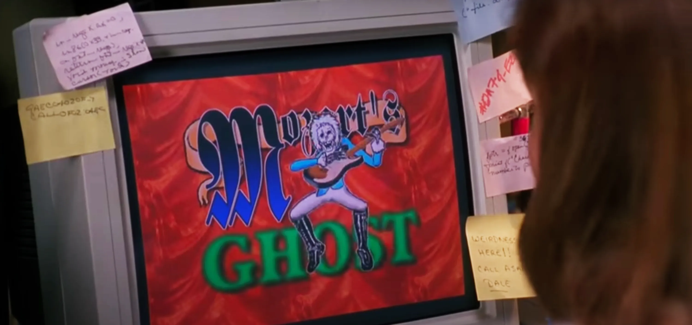

# Express Redirect

This is a straightforward script that redirects users based on a parameter ID. If the parameter ID matches an index in the array, it will proceed with the matching process and redirect the user. If the parameter ID matches the letter "r", the code will trigger a randomization process. Any invalid parameters will redirect the users to the hottest band on the internet [Mozart's Ghost](https://www.youtube.com/watch?v=hoWEYBSlctc).

 

## Site
* Valid URL: [notiempo.lol/mozartsghost/5](https://notiempo.lol/mozartsghost/5)
* InValid: [notiempo.lol/mozartsghost/100](https://notiempo.lol/mozartsghost/1000)
* Random: [notiempo.lol/mozartsghost/r](https://notiempo.lol/mozartsghost/r)

